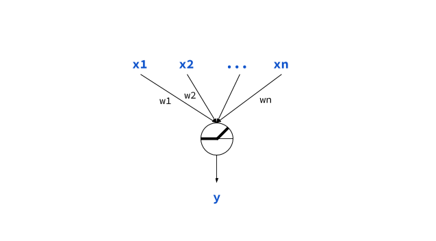

# [fit] Deep Learning Bootcamp
_**Getting Started with Image & Text**_
 
 
 

**Amit Kapoor** [@amitkaps](http://amitkaps.com)
**Bargava Subramanian** [@bargava](http://bargava.com)
**Anand Chitipothu** [@anandology](http://anandology.com)

---

# Bootcamp Approach

- **Domain**: Image & Text
- **Applied**: Proven & Practical
- **Intuition**: Visualisation & Analogies 
- **Code**: Learning by Doing
- **Math**: Attend HackerMath!

---

# Learning Paradigm

---

# Learning Types

- **Supervised**: Regression, Classification, ...
- Unsupervised: Dimensionality Reduction, Clustering, ...
- Semi-supervised
- Reinforcement

---

# Learning Approach

 

---

# Data Representation: Tensors

- Numpy arrays (aka Tensors)
- Generalised form of matrix (2D array)
- Attributes
    - Axes or Rank: `ndim` 
    - Dimensions: `shape` e.g. (5, 3) 
    - Data Type: `dtype` e.g. `float32`, `uint8`, `float64`

---

# Tensor Types

- **Scalar**: 0D Tensor
- **Vector**: 1D Tensor
- **Matrix**: 2D Tensor
- **Higher-order**: 3D, 4D or 5D Tensor

---

# Input X

| Tensor |  Example |  Shape                |
|:-------|:---------|:----------------------|
| 2D     | Tabular  | (samples, features)    |
| 3D     | Sequence | (samples, steps, features)    |
| 4D     | Images   | (samples, height, width, channels)    |
| 5D     | Videos   | (samples, frames, height, width, channels)    |

---

# Learning Unit

- weights
- activation: **RELU** `f(x) = max(x,0)`

$$
y = activation(dot(w,x) + b)
$$

---

# Model Architecture 

Model: Sequential

Core Layers
- Dense Layers: Fully connected layer of learning units
- Flatten
- Reshape
- ...

---

# Output y & Loss

| Tensor |  Last Layer |  Loss Function      |
|:-------|:---------|:----------------------|
| Binary Class     | sigmoid  | Binary Crossentropy |
| MultiClass     | softmax | Categorical Crossentropy   |
| MultiClass Multi Label     | sigmoid   | Binary Crossentropy    |
| Regression     | None   | Mean Square Error   |
| Regression (0-1)    | sigmoid   | MSE or Binary CrossEntropy Square Error   |

---

# Optimizer

- SGD
- RMSProp
- Adam
